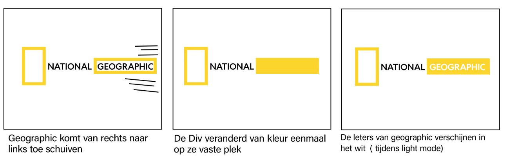
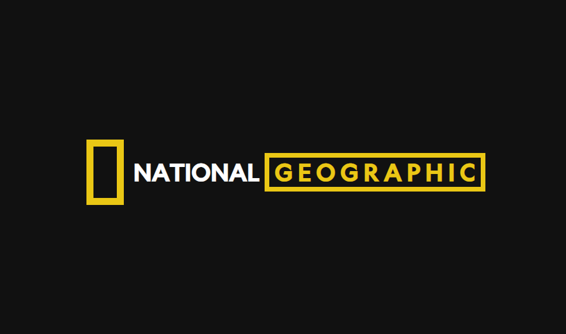
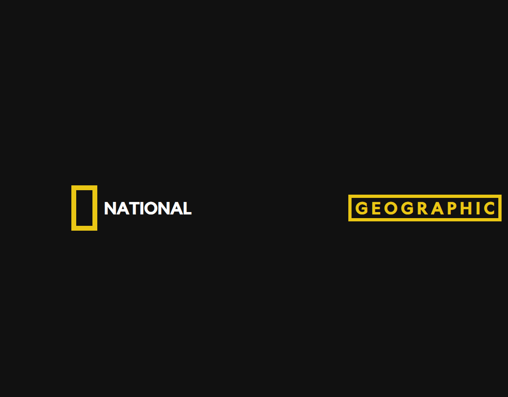
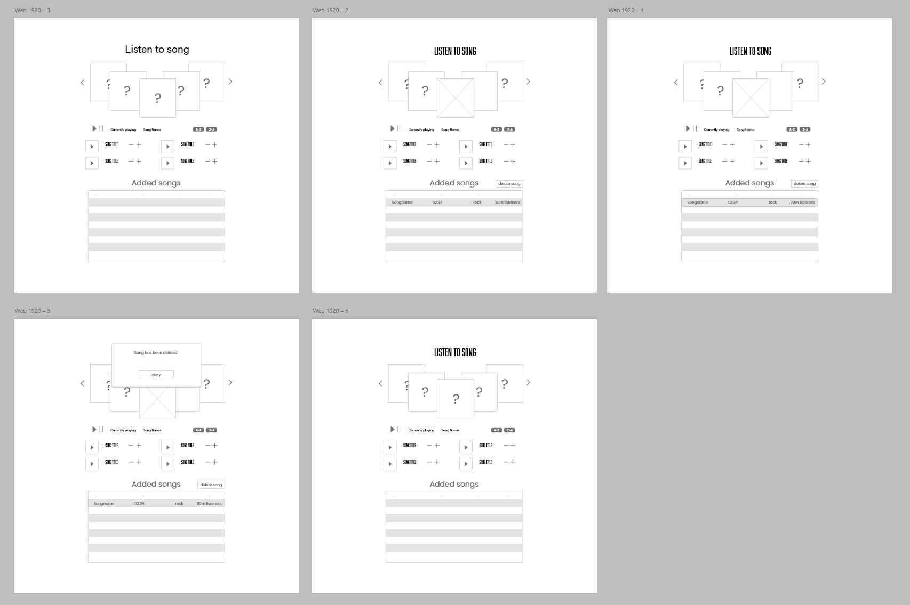
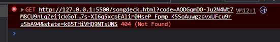
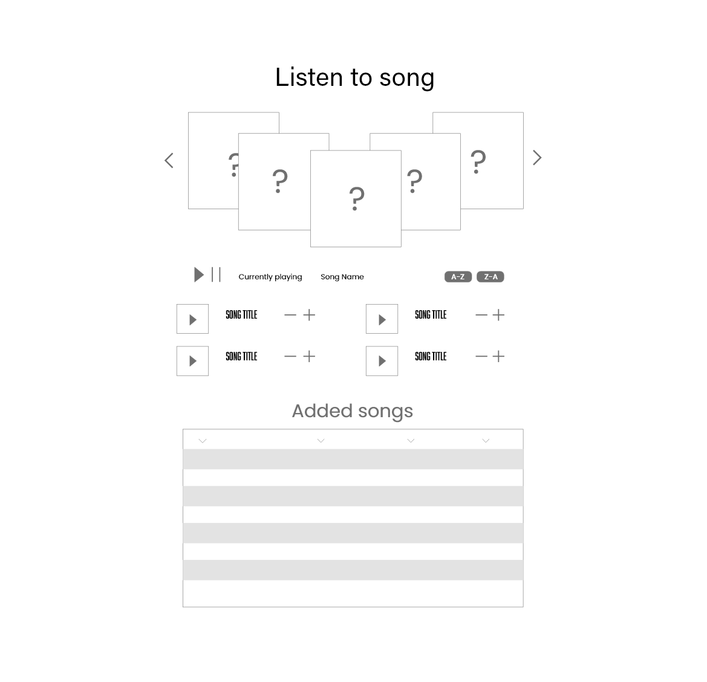

# Procesverslag
**Auteur:** -jouw naam-

**De opdrachten:** [opdracht 1](opdracht1/index.html) en [opdracht 2](opdracht2/index.html)

Markdown is een simpele manier om HTML te schrijven.  
Markdown cheat cheet: [Hulp bij het schrijven van Markdown](https://github.com/adam-p/markdown-here/wiki/Markdown-Cheatsheet).

Nb. De standaardstructuur en de spartaanse opmaak van de README.md zijn helemaal prima. Het gaat om de inhoud van je procesverslag. Besteedt de tijd voor pracht en praal aan je website.

Nb. Door *open* toe te voegen aan een *details* element kun je deze standaard open zetten. Fijn om dat steeds voor de relevante stuk(ken) te doen.

## Bronnenlijst
  1. https://stackoverflow.com/questions/50840168/how-to-detect-if-the-os-is-in-dark-mode-in-browsers
  2. https://www.youtube.com/watch?v=wGPDuqgkoew
  3. https://developer.spotify.com/documentation/web-api/tutorials/code-pkce-flow
  4. https://stackoverflow.com/questions/246801/how-can-you-encode-a-string-to-base64-in-javascript
  5. Discord server "The programmer's hangout" https://discord.gg/programming
  6. Sanne
  

## Opdracht 1 plan

  
uitwerken na schetsen idee (voor week 2)

  ### Je storyboard:
  

  ### Je ambitie: 
  Aan deze technieken/punten wil ik werken:
  - Leren hoe een logo geanimeerd kan worden in css
  - De techniek achter darkmodus leren
 
 

## Opdracht 1 reflectie

  
uitwerken bij afronden opdracht (voor week 4)

  ### Je uitkomst - karakteristiek screenshot(s):
  

  ### Dit ging goed/Heb ik geleerd: 
  Korte omschrijving met plaatje(s)
  Ik heb geleerd dat je hoe je in puur css kan animeren. Ik wist hiervoor ook niet hoe je darkthemes moest maken, na wat onderzoeken bleek het simpeler dan dat ik had verwacht.

  

  ### Dit was lastig/Is niet gelukt:
  Korte omschrijving met plaatje(s)

  Ik moest meerdere animaties toevoegen aan het zelfde object, ik raakte ergens in de war en dacht dat ik steeds een ander object eromheen moest aanspreken om het te laten werken. Bleek dat het ook werkt als ik een , zet en animation delays gebruik.

  

## Opdracht 2 plan

  
uitwerken na schetsen idee (voor week 5)

  ### Je ontwerp:
  

  ### Je ambitie: 
  Aan deze technieken/punten wil ik werken:
  - Ik wil beter worden met web applicaties
  - beter worde in het gebruik van api's 

## Opdracht 2 test

  
uitwerken na testen (week 7)

  Neem minimaal 5 bevindingen op:

  ### Bevinding 1:
  Omschrijving van wat er nog niet orde was (tekst en afbeeding(en)).

  #### oplossing:
  Beschrijving hoe je het hebt hebt opgelost of als het niet gelukt is hoe je het zou oplossen (tekst en afbeeding(en)).

  ik ben bezig geweest met het designen coderen van de html kant, dit ging opzich wel goed moet alleen een manier vinden om de cards ook daadwerlijker swipeable te maken zonder javascript libary's 

  ### Bevinding 2:
  Omschrijving van wat er nog niet orde was (tekst en afbeeding(en)).

   

   Tijdens het developen van deze opdracht kwam maakte ik gebruik van de open api variant, alleen kon ik niet precies doen wat mijn eigen doel is dus ben ik geswitched naar de api met autherizer (PKCE)
    

  #### oplossing:
  Beschrijving hoe je het hebt hebt opgelost of als het niet gelukt is hoe je het zou oplossen (tekst en afbeeding(en)).

  ik heb het opgelost ik heb hulp gekregen in developer groepen op discord. Zei gaven aan dat ik mijn fetch verkeerd deed in de array

  ### Bevinding 3:
  
  Uiteindelijk toch niet geredt, ik zal het inorde krijgen voor de herkansing. 

## Opdracht 2 reflectie

  
uitwerken bij afronden opdracht (voor week 8)

  ### Je uitkomst - karakteristiek screenshot(s):
  

  ### Dit ging goed/Heb ik geleerd: 
  Korte omschrijving met plaatje(s)

  

  ### Dit was lastig/Is niet gelukt:
  Korte omschrijving met plaatje(s)

  

